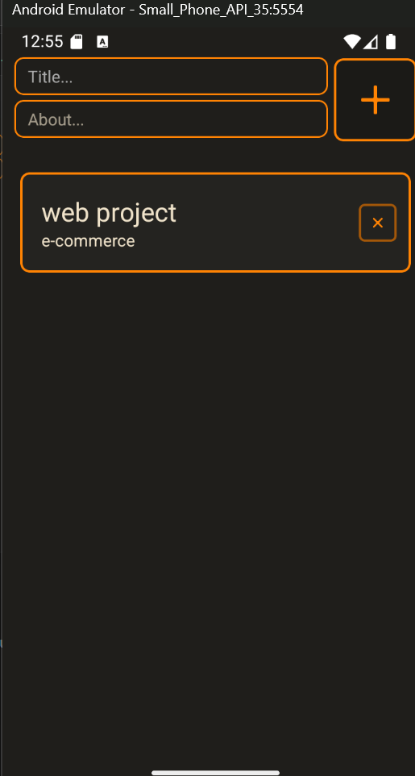
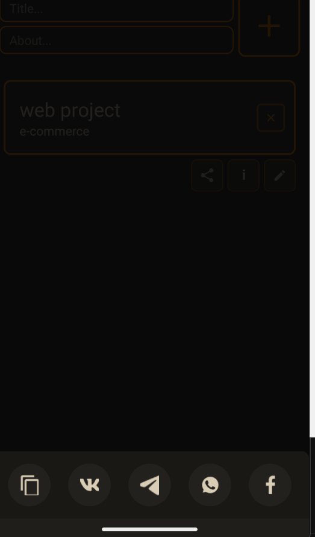
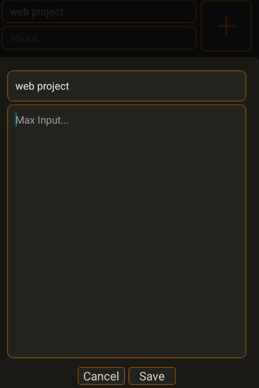
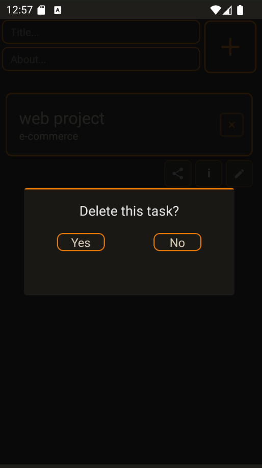

# 📋 React Native To-Do List App

A **feature-rich To-Do List mobile application** built with **React Native** and **TypeScript**, supporting task creation, editing, deletion, sharing, and viewing detailed task info. The app uses **Zustand** for state management and **AsyncStorage** for local persistence.

---

### 🎥 Demo Video

<video controls src="./readmefiles/Untitled video - Made with Clipchamp.mp4" title="To-Do-List Demo"></video>

---


### 🎨 Figma Design

[View on Figma](https://www.figma.com/design/0voUh3g2fDdGMbKNibqygj/To-Do-List--Community-?node-id=42-188)

---

## 🧰 Tech Stack

- ⚛️ React Native (CLI)
- ⌨️ TypeScript
- 🐻 Zustand (State Management)
- 💾 AsyncStorage (Persistence)
- 🧩 Modular Components
- 🎨 CSS for custom styles

---

## 🚀 Features

- 📝 **Add Tasks** – Add tasks with title and description  
- ✏️ **Edit Tasks** – Modify task details  
- ❌ **Delete Tasks** – Confirm before deleting  
- ✅ **Mark as Complete** – Tap to mark a task done  
- ℹ️ **Task Info** – View task metadata in a modal  
- 📤 **Share Tasks** – Share tasks via WhatsApp, Telegram, Facebook, VK, or copy to clipboard  
- 📦 **Persistent Storage** – All tasks are saved locally  
- 🧠 **Central State** – Managed via Zustand for smooth updates  
- 🖼️ **FlatList UI** – Efficient, scrollable list  
- 🎨 **Custom Design** – Material-inspired visuals

---

## ⚙️ Getting Started

### 📋 Prerequisites

- Node.js
- Android/iOS device or emulator

### 🛠️ Installation

```bash
git clone https://github.com/vipusrihar/To-do-list.git
cd To-do-list
npm install

# Run on Android emulator or connected device
npx react-native run-android
```

---

## 📁 Project Structure

```bash
.
├── assets/               # App icons, images
├── features/             # Reusable components
│   ├── EditModal.tsx
│   ├── InputContainer.tsx
│   ├── ShareModal.tsx
│   ├── InfoModal.tsx
│   ├── DeleteModal.tsx
│   └── renderItem.tsx
├── store/
│   └── useToDoStore.ts   # Zustand store
├── type/
│   └── types.ts          # TypeScript types
├── utils/
│   └── shareTask.ts      # Sharing logic
├── App.tsx               # Main entry point
└── ...
```

---

## 📦 AsyncStorage Structure

- **`todos`**: Array of task objects  
  - `id`: Unique ID  
  - `title`: Task title  
  - `about`: Task description  
  - `created`: Timestamp  
  - `completed` : Task Status

- **`taskId`**: Incremental ID tracker

---

## 👩‍💻 Author

**Vipusa Sriharan**  
Third Year Software Engineering Undergraduate  
[GitHub Profile](https://github.com/vipusrihar)

---


### 📸 Screenshots

| | | |
|---|---|---|
|  |  |  |
|  |  |  |

---
